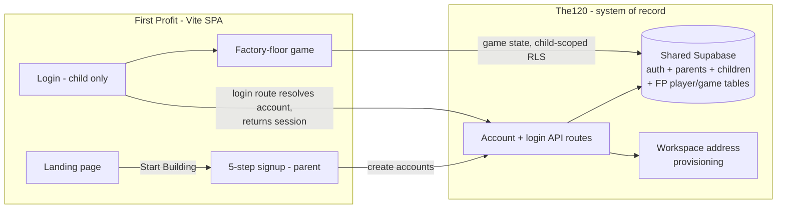

# First Profit v2: fpv2 Prototype Build with The120 as the System of Record

## Problem Frame

First Profit is one product of the parent company The120. The fpv2 prototype
(`artifacts/fpv2prototype/design_handoff_v1_user_flow/`) defines the complete v1
experience: a parent-facing landing page, a 5-step Start Building signup, and the
factory-floor game where a child works Sell-phase criteria 1.1 and 1.2 across up to
five product ideas. Today the app (`src/`) is a frontend-only Vite/React/Tailwind
SPA with no accounts and no persistence.

The120 already operates the family identity system: Supabase auth with a `parents`
table keyed to `auth.users`, a `children` roster (including `child_email` and
`child_email_none`), real provisioned child login accounts, and a Google Workspace
address-issuance pipeline with a never-reissue ledger. That database is the system
of record. First Profit builds the fpv2 experience on top of it: parents sign up
on First Profit (populating The120), and children — the actual product users —
log in with real The120 credentials.

**Relationship to The120's existing `/fp` app:** The120 currently ships a
child-facing "First Profit" PWA at `/fp` (sign-in, onboarding, tasks, criteria,
review, family dashboard). **The fpv2 game replaces `/fp` as the student
experience**: once fpv2 reaches parity for the flows children actually use, `/fp`'s
child-facing surfaces are retired/redirected to firstprofit.school. Parent-, staff-
and review-facing surfaces remain The120's and are out of First Profit's scope.
The120's existing students are First Profit students; there is no separate "Path
student" population.

**Launch posture:** payment Phases 1–3 (see Payments) are internal build
milestones. No outside families are onboarded until real money works, so the
app's copy is the final real-money copy from the start; the mock checkout is
internal scaffolding, never a public promise.

## Requirements

**Identity and login**

- R1. Children authenticate with real Supabase auth against The120's Supabase
  project. A child session is a genuine `auth.users` session, not an email
  existence check.
- R2. The First Profit Login button is for children only. Any child in The120's
  database with a login account can enter First Profit — no per-product
  entitlement gate. The child check happens server-side in the login route (R4):
  the route resolves the account against The120's roster, refuses non-child
  accounts, and ensures a First Profit player-profile row (R18) exists before a
  session is returned. (The refusal is backed by the server check, not client
  UX; note that any authenticated session also retains whatever pre-existing
  The120 RLS grants it holds — see R20.)
- R3. Parents do not log into the First Profit game; their surface is the signup
  flow and email (R26–R27). The120's parent/review surfaces continue to serve
  parents.
- R4. Login goes through a The120-hosted login API route (the same pattern
  `/fp`'s sign-in uses today): the child enters name + password (existing
  students, whose auth accounts use synthetic non-deliverable addresses) or
  email + password (accounts created by First Profit signup); the route resolves
  the account server-side, performs the child check, creates the player profile
  on first login (R18), and returns a Supabase session. The login screen is a
  designed surface in the prototype's HQ visual language with explicit states:
  wrong credentials, not-a-child account, rate-limited. Error copy must not
  confirm whether an address/name has an account (enumeration resistance) while
  staying kid-friendly. Net-new UI — design during planning to the handoff's
  fidelity bar.
- R5. First-run onboarding for existing The120 children: a child who logs in
  having never completed First Profit signup is routed through an in-game version
  of onboarding screens 2–5 (founder profile → website reveal → money booth →
  The Path) before reaching the factory floor. The 5-segment progress bar keeps
  all five First Profit colors, with step 1 (parent account) shown already
  complete. Every child reaches the floor with a handle, founder profile, and
  Idea #1.
- R6. Sessions and sign-out: the game has a logout affordance (shared family
  devices and school Chromebooks are the norm), and session expiry mid-play must
  not silently lose Step Runner input. Draft input preserved locally is keyed to
  the authenticated account, restored only when that same account re-logs-in,
  and purged on explicit logout or when a different account signs in on the
  device.
- R7. Child password reset is parent-triggered through a The120-hosted
  service-role API route — the pattern The120 already uses (no auth mail:
  Supabase confirmations are disabled project-wide, there is no custom SMTP, and
  a standing invariant forbids auth mail to student addresses; existing students'
  addresses are undeliverable by design). The parent recap email (R26) carries a
  link the verified parent uses to set a new child password. Supabase reset
  email is never relied on for child accounts.
- R8. Child password policy: minimum 8 characters (matching the parent rule in
  the prototype), with login rate-limiting/lockout at the login route. Note:
  Supabase project-level auth settings are shared with all of The120 — any
  change to them is a The120-wide change and must be treated as such.

**Start Building signup (full self-serve)**

- R9. Completing Start Building creates, in The120's database in one sitting: the
  parent's real auth account + `parents` row, the child's `children` row, the
  child's login account, and the child's First Profit player-profile row (R18).
  A brand-new family goes from landing page to a playing child in a single
  session (qualified by R11's verification step and R13's exception path).
- R10. The signup flow is idempotent and resumable: partial failures (parent
  account created but child step fails, browser closed mid-flow, retried
  submissions) must converge on one consistent family, never duplicates or
  orphans. This includes the expected case where the parent's email already has
  a The120 auth account (from an application or deposit): signup routes them
  through sign-in and attaches the child to their existing `parents` row.
  Planning defines the mechanism; the requirement is that no partial state
  strands a family or blocks their email from retrying.
- R11. The parent must verify their email address during signup, in-flow: the
  signup UI includes a verification wait state (code entry, or link-click with
  polling) with defined behavior when verification does not arrive in the
  sitting (flow is resumable per R10). Child-account creation on path (a) and
  Workspace issuance on path (b) fire only after parent verification.
- R12. The signup flow collects the child's credential with two paths:
  (a) parent enters the child's existing email address (stored in
  `children.child_email`) and sets an initial password (held only by Supabase
  auth, never stored in application tables); or (b) parent indicates the child
  has no email and requests First Profit provision one — triggering the same
  Google Workspace address-issuance flow already designed in The120
  (`child_email_none` + provisioning machinery). On path (b) the parent likewise
  sets the child's password in-session; it is held securely and transiently with
  the provisioning claim and bound to the account when the account is created.
  On path (a) the child's address is accepted without child-side verification;
  if the address already has an auth account, signup blocks with "log in
  instead" guidance. The residual risk (a parent claiming an address they don't
  control) is accepted for v1. The child password must be excluded from request
  logs, error traces, and telemetry on all signup/provisioning routes.
- R13. Provision-an-address path timing: when an address is issuable in-session,
  the child's login account is created immediately with the issued address and
  the parent-chosen password, so play starts the same sitting; only mailbox
  readiness may lag. When issuance cannot complete in-session (human exception
  queue: underivable name, exhausted candidates; or Workspace degradation),
  signup still completes — the family is told the child's login is being
  prepared, and the ready-notification email (to the verified parent) confirms
  the child can now log in with the password the parent chose. The signup UI
  must handle this branch explicitly.
- R14. The signup UI follows the fpv2 prototype's 5-screen sequence and design
  tokens. The child credential step (R12) extends screen 2 (founder profile) —
  child email/password fields, with a "my kid doesn't have an email" toggle that
  swaps in the provision-me variant. Planning may adjust layout within screen 2
  but not add a sixth progress segment.
- R15. Guardian consent is a launch gate for new signups: before any outside
  family can sign up, the consent language and mechanism (prototype screen 1's
  guardian-consent note as a starting point) must be confirmed sufficient for a
  self-serve product collecting data on children ages 8–16. Sign-off is a
  release criterion for Slice B. For existing The120 children (Slice A), the
  family's existing recorded consent is treated as sufficient — a documented,
  accepted decision.
- R16. Signup, provisioning, and login API routes are rate-limited and
  abuse-protected, and each route authenticates its caller independently of
  CORS (CORS is browser-side only): later-stage endpoints require a signed
  session/step token proving the prior step (e.g. parent verification) actually
  completed, and the allowed origin is scoped to firstprofit.school. Workspace
  issuance burns names in a never-reissue ledger and creates human ops work, so
  scripted or out-of-sequence calls must be cheap to reject.
- R17. CRM effect is intended: First Profit signups flow into The120's CRM via
  the existing `on_parent_created` machinery, with a recorded origin
  (`first-profit`) so staff can distinguish them from other funnels and nurture
  flows can branch. The scope boundary "no changes to The120 behavior" excludes
  this deliberate consequence.

**Identity linkage and game data (in The120's database)**

- R18. A First Profit player-profile table links the child's auth account
  (`auth.users`) to their `children` row and carries game-owned profile basics
  (handle, site headline). It is created by the signup flow (Slice B) or by the
  login route on an existing child's first login (Slice A). Where a child also
  has a `path_student_profiles` row, the player profile's (user_id, child_id)
  pair MUST match it — `path_student_profiles` remains the identity authority;
  the player profile carries only game-owned fields. Deletes follow the same
  RESTRICT posture as the existing identity link. Handles are unique.
- R19. Game state is persisted server-side, keyed to the player profile: ideas
  (fields + done maps), active idea, and the sales/backings ledger. The ledger
  is append-only (last-write-wins never applies to it). Progress survives
  devices and browsers; client-side memory is a cache, not the store.
- R20. First Profit's tables use explicit child-scoped RLS policies. The120's
  posture is mixed, not service-role-only: `parents`, `children`, `deposits`,
  and gauntlet tables already carry authenticated parent-scoped policies, while
  path/fw tables are RLS-enabled with zero policies. Therefore the security
  review required here covers **every policy reachable by a session minted via
  First Profit login** — the new FP tables AND the pre-existing
  authenticated-role policies that a session from firstprofit.school can
  exercise — with the accepted exposure enumerated in writing. Every FP policy
  is security-reviewed before the anon key can touch the table in production;
  anon-key access to any FP table without a reviewed policy is denied by
  default.

**The game (fpv2 scope)**

- R21. Build the full fpv2 prototype experience in the app: landing page, factory
  floor (Path / Company / Products rows), Sell-phase floor with five rooms
  (1.1–1.2 playable; 1.3–1.5 "coming in the next build"), multi-idea model (max
  5 ideas, active idea, idea picker), Step Runner with task copy from
  `src/data/path.ts` (1.1 + 1.2), celebrations, room dialogs (Your Site, Checkout
  Booth, Sales Room, Idea Room), avatar walking, and the checkout overlay —
  high-fidelity to the handoff README (colors, type, copy final; no em dashes).
- R22. Mobile quality per repo standard: every screen works at ~390px with the
  existing breakpoint architecture (`lg` floor switch, `sm` overlay switch);
  desktop re-verified.

**Payments (phased build milestones, all pre-launch)**

- R23. Phase 1: the mock Stripe checkout as prototyped — backings and sales are
  recorded in the server-side ledger but no money moves. App copy is the final
  real-money copy (the "Test mode" labeling lives only inside the mock checkout
  itself). Ledger rows carry a source/status discriminator from day one so
  test-era rows are identifiable.
- R24. Phase 2: real Stripe Checkout in test mode — actual Stripe sessions and
  webhooks writing the ledger — behind the same prototype-designed UI.
- R25. Phase 3: live money — real charges routed through the First Profit
  account, store credit, and regular payouts released to the parent, per the
  signup screen's promise. Public launch happens after this phase; before
  launch, test-era ledger rows are purged (purge mechanism must be reconciled
  with The120's additive-only migration discipline during planning).

**Parent loop**

- R26. Signup sends the verified parent a recap email: accounts created, how the
  child logs in, the parent-held password-reset link (R7), what happens next.
- R27. A periodic progress digest email to the parent (tasks completed, criteria
  passed, first sale/backing). Simple and low-frequency; a parent dashboard
  remains out of scope.
- R28. Data rights: the doc assumes The120's existing data-retention/deletion
  policy covers FP-owned tables; planning confirms this and, if absent, adds a
  support path by which a parent can request deletion/export of their child's
  First Profit data.

**Integration architecture**

- R29. The120's Supabase project is the single system of record; First Profit
  creates no parallel user store.
- R30. First Profit remains a Vite SPA. Login and account flows go through
  The120-hosted API routes (R4, R30→R32); game-state reads/writes go directly
  to the shared Supabase project under the RLS regime of R20.
- R31. Sensitive flows — parent signup, child auth-account creation, Workspace
  address provisioning, login resolution, password reset — run as API routes
  hosted on The120, which already owns that machinery and the service-role key.
  First Profit's browser code never holds service-role credentials.

## Build Sequencing

Two slices, so a playable increment exists before the cross-repo funnel is done:

- **Slice A — the game on real accounts:** fpv2 game (R21–R22), child login via
  The120's login route (R1–R8), player profiles + game tables with RLS
  (R18–R20), first-run in-game onboarding for existing The120 children (R5),
  mock checkout (R23). The120-side work: the FP tables, the login/profile route,
  and the parent-triggered reset route.
- **Slice B — Start Building:** the self-serve signup and provisioning path
  (R9–R17) plus parent emails (R26–R28).
- Payment Phases 2–3 (R24–R25) follow as their own plans. `/fp` child-facing
  retirement happens when fpv2 reaches parity for child-used flows (its own
  small plan on The120's side).

## Success Criteria

- A new parent completes Start Building on firstprofit.school — verifying their
  email in-flow — and, whenever path (a) is used or an address is issuable
  in-session, their child logs in with their own credential and completes task
  1.1.1 in the same sitting. When provisioning lands in the exception queue,
  signup still completes and the family is notified when the login is ready.
- A First Profit signup produces: a parent auth account + `parents` row, a
  `children` row, a child auth account, a player-profile row, and a CRM family
  with `first-profit` origin. (Not byte-identical to funnel-provisioned
  families — the required invariants are exactly these rows.)
- An existing The120 child logs in with their existing credentials (name +
  password), completes the in-game onboarding (screens 2–5, step 1
  pre-completed), and reaches the factory floor with handle, profile, and
  Idea #1.
- A child who logs in from a different device sees their ideas, task progress,
  and ledger intact.
- A parent account, or any non-child The120 account, is refused by the login
  route with a clear (non-enumerating) message.
- The "no child email" happy path yields a working login in-session, with the
  parent-chosen password, and an issued Workspace address honoring The120's
  never-reissue guarantees.
- Basic funnel instrumentation exists: signup step completion, child first
  login, and return sessions are measurable before outside families arrive.
- Every screen (including the new login and first-run onboarding screens) passes
  the ~390px mobile check and desktop re-check.

## Scope Boundaries

- No parent-facing app surface (no dashboard, verification UI, or progress
  views); the parent loop is email only (R26–R28). The120's existing
  parent/review surfaces continue unchanged.
- No real payment processing until Phase 2/3 builds; no public launch until
  Phase 3 is done.
- Sell criteria 1.3–1.5 and phases Build through Scale are visible but not
  playable, exactly as the prototype specifies.
- No per-product entitlement system (the player-profile gate is an identity
  link, not an entitlement framework).
- No changes to The120's existing funnel, CRM, or Path program behavior beyond
  additive tables/routes — except the intended CRM lead creation of R17.
- `/fp` retirement is sequenced after fpv2 parity, as its own effort; nothing in
  Slice A/B removes `/fp`.
- The kid site (`firstprofit.school/<handle>`) is the in-game mockup from the
  prototype, not separately-hosted real websites.
- No conflict-resolution UI for simultaneous multi-device edits (last write
  wins for non-ledger state; the ledger is append-only per R19).

## Key Decisions

- **Real Supabase auth for children** (not an email-exists check or magic link):
  real sessions enable RLS-protected server-side progress and reuse The120's
  identity machinery.
- **fpv2 replaces `/fp` as the student experience**: one brand, one app, one
  login door for children; The120 keeps parent/staff/review surfaces.
- **Login through a The120-hosted route** (name-or-email + password): matches
  how existing students already authenticate (server action; synthetic
  undeliverable auth addresses), performs the child check and first-login
  profile creation server-side, and avoids duplicating credential logic in the
  browser.
- **Full self-serve signup**: preserving the prototype's "day one takes ten
  minutes" promise outweighs the safety of routing families through The120's
  ops-gated funnel — with in-flow parent email verification, step tokens, and
  rate limits (R11, R16) as the guardrails.
- **Parent enters child email + password, with a provision-me option**: works for
  families with existing email, and reuses The120's designed Workspace flow for
  those without. On the provision path the parent also sets the password
  in-session. Child-side email verification is deliberately skipped for v1
  (R12); parent verification is the accountability anchor.
- **Child-scoped RLS on FP-owned tables, with a whole-surface security review**:
  The120's posture is mixed (parent-scoped policies already exist on shared
  tables), so the review covers everything an FP-minted session can reach, not
  just new tables.
- **Parent-triggered password reset, no auth mail**: The120 has auth mail
  disabled by invariant; the parent is the reset authority via a service-role
  route, consistent with The120's existing pattern.
- **Server-side game state**: real accounts buy nothing if progress dies with the
  browser; the parent digest depends on it.
- **Phases are build milestones, not releases**: mock → Stripe test → live money
  are sequenced internally; outside users only ever see the real-money product,
  so the app carries final copy from the start.
- **CRM ingestion is intended**: First Profit families are The120 families;
  origin tagging keeps staff and nurture flows able to tell funnels apart.
- **Existing consent covers Slice A**: The120's recorded family consent is
  treated as sufficient for existing children entering the game (documented,
  accepted decision).
- **Two-slice delivery**: the game ships to existing The120 children before the
  cross-repo signup funnel exists, de-risking the schedule.
- **Shared Supabase + The120-hosted API** over an all-API boundary or a First
  Profit backend: least new infrastructure, one identity system, and the
  service-role key stays only where it already lives.

## Dependencies / Assumptions

- The120's Workspace provisioning pipeline can be invoked for First Profit
  signups (today it is driven by The120's funnel; exposing it via an API route
  is new work on The120's side).
- Creating a child auth account with a parent-chosen password is a new
  provisioning path; assumed acceptable to The120's identity model — confirm
  early in planning, as R12 depends on it. Holding the path-(b) password
  transiently against the provisioning claim needs a vetted secure mechanism.
- Parent email verification cannot use Supabase's built-in confirmation
  machinery (disabled; no custom SMTP) — reuse The120's proven self-issued
  token + transactional email pattern.
- Cross-origin calls from firstprofit.school to The120's API routes are
  permitted, with the origin allowlist scoped to firstprofit.school.
- All new tables/migrations land in The120's production database under its
  MIGRATION-LOCK discipline (additive-only, authoring-is-applying, Management
  API); First Profit's iteration speed on schema inherits that regime.
- The fpv2 handoff README is the authoritative spec for UI fidelity; where it
  conflicts with older `src/` behavior, the handoff wins. The login screen and
  first-run onboarding are net-new designs held to the same bar.
- The120's `children` table carries funnel guard triggers and a live
  parent-scoped FOR-ALL policy; FP's own writes to `children` go through
  service-role API routes, and the R20 review documents what browser sessions
  can already reach.

## Outstanding Questions

### Deferred to Planning

- [Affects R18–R20][Technical] Exact schema for player-profile and game tables,
  their RLS policies, and the R20 whole-surface review checklist (including
  pre-existing authenticated policies reachable from FP's origin).
- [Affects R4][Technical] Login route contract: how the name-or-email resolution
  composes with `/fp`'s existing sign-in action, and session handoff to the SPA.
- [Affects R9–R13][Technical] Signup/provisioning API contract, the
  idempotency/resume mechanism (R10), step-token design (R16), and composition
  with the provisioning lease and never-reissue ledger without disturbing
  funnel invariants.
- [Affects R12][Technical] Secure transient custody of the path-(b) password
  between signup and account creation (including the exception-queue case).
- [Affects R13][Technical] Exception-queue UX detail: exact copy and email
  cadence when a provisioned login isn't ready in-session.
- [Affects R27][Technical] Digest mechanism and cadence (reuse The120's email
  infrastructure).
- [Affects R21][Technical] How much of existing `src/` (GameContext, path data,
  FactoryFloor/MobilePath) is evolved vs. replaced — the handoff says evolve.
- [Affects R5][Technical] What, if anything, from a child's `/fp` progress
  (tasks, criteria evidence) seeds their fpv2 game state, and what `/fp` parity
  means concretely before child-facing retirement.

## Next Steps

-> `/ce:plan` for structured implementation planning, starting with **Slice A**
(game + child login via The120 route + player profiles + server-side state +
mock checkout).
